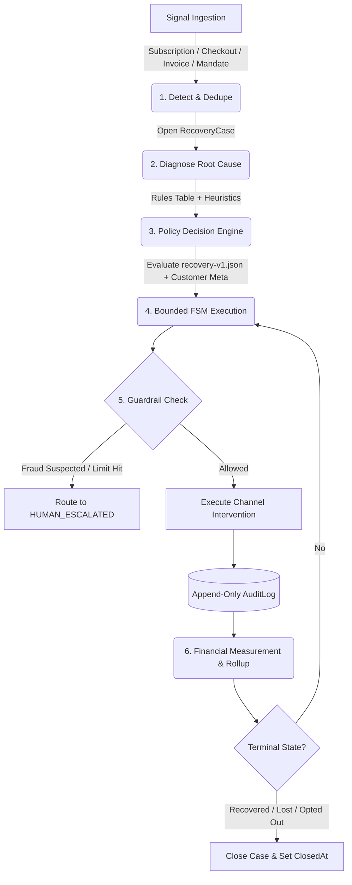

# SentinelPay — Autonomous AI Revenue Recovery Engine

> **Intelligent, policy-driven revenue recovery agent built for modern payment ecosystems.**  
> Continuously watches for revenue at risk across subscriptions, one-off payment degradations, abandoned checkouts, overdue B2B invoices, and bank mandates—diagnosing root causes, executing bounded interventions, enforcing hard safety guardrails, and proving recovered revenue on an interactive dashboard backed by an append-only audit trail.

---

## 📑 Table of Contents

- [Executive Summary](#-executive-summary)
- [System Architecture & Lifecycle](#-system-architecture--lifecycle)
- [The 6 Recovery Adapters (Multi-Rail)](#-the-6-recovery-adapters-multi-rail)
- [Safety Guardrails & Stopping Rules](#-safety-guardrails--stopping-rules)
- [Interactive Dashboard & Features](#-interactive-dashboard--features)
- [Technology Stack](#-technology-stack)
- [Getting Started](#-getting-started)
- [Versioned Policy Engine](#-versioned-policy-engine)
- [API Reference](#-api-reference)
- [Future Roadmap & Scalability Improvements](#-future-roadmap--scalability-improvements)
- [Security & Compliance](#-security--compliance)

---

## 💡 Executive Summary

Involuntary churn and payment drop-offs cost businesses up to **10–15% of ARR**. Generic recovery systems rely on blind, brute-force retry schedules that trigger customer complaints, bank bounce penalties, and merchant risk flags.

**SentinelPay** transforms revenue recovery from a dumb cron-job into an **autonomous, explainable, multi-rail agent**:
1. **Multi-Rail Signal Ingestion**: Unifies failed cards, UPI autopay/mandate misses, abandoned checkout carts, and overdue B2B invoices onto a single spine.
2. **Deterministic Root-Cause Diagnosis**: Classifies gateway decline codes with deterministic precision rather than relying purely on hallucination-prone LLM calls.
3. **Contextual Policy Interventions**: Aligns retry timing with customer paydays, triggers single-touch expiring recovery links, sequences banking mandate windows, and deploys Hinglish AI voice outreach.
4. **Hard Guardrails in Code**: Programmatically halts retries on suspected fraud, enforces quiet hours (DND), caps contact frequency, and enforces discount ceilings.
5. **Tamper-Evident Proof**: Maintains an append-only audit trail logging every intent, actor, input, output, and message payload to guarantee complete compliance.

---

## 🏗️ System Architecture & Lifecycle

The engine operates on a strict, finite 6-stage lifecycle without open-ended loops:



### Stage-by-Stage Breakdown:

1. **Detect (`src/engine/run.ts`)**: Ingests failure signals from source records (`PaymentAttempt`, `CheckoutSession`, `Invoice`, `Mandate`), deduplicating them into exactly one `RecoveryCase` per failure cycle.
2. **Diagnose (`src/engine/diagnose.ts`)**: Deterministically maps raw decline codes (`insufficient_funds`, `expired_card`, `fraud_suspected`, `do_not_honor`, `gateway_timeout`) to classified root causes.
3. **Decide (`src/engine/policy.ts`)**: Evaluates versioned JSON policies (`policies/recovery-v1.json`) against customer attributes (LTV, risk tier, payday date, contact history).
4. **Execute (`src/engine/fsm.ts`)**: Advances the case through bounded finite states:
   `OPEN` → `RETRY_1` → `RETRY_2` → `RETRY_3` → `NUDGE_SENT` → `CLOSED`
5. **Enforce Guardrails (`src/engine/stopping.ts`)**: Programmatic stopping rules evaluate fraud flags, timebox duration, discount budgets, and quiet hours.
6. **Audit & Measure (`src/engine/measure.ts`)**: Logs immutable audit records with timestamp, actor (`system`/`agent`/`human`), input/output JSON, and message bodies.

---

## 🔌 The 6 Recovery Adapters (Multi-Rail)

Instead of a single-purpose dunning tool, SentinelPay provides a unified recovery spine supporting 6 specialized payment rails:

| # | Direction | Signal Source | Typical Root Cause | Autonomous Policy Strategy |
|---|---|---|---|---|
| **1** | **Failed Subscriptions** | `PaymentAttempt` (`subscription`) | `insufficient_funds`, `expired_card` | Aligns retries to customer payday (Days 1, 5, 7, 15) to avoid bounce fees, or sends card update email. |
| **2** | **Payment Degradation** | `PaymentAttempt` (`one_off`) | `gateway_timeout`, `issuer_risk` | Switches payment presentation route to backup gateway (`razorpay_backup`) or requests backup card. |
| **3** | **Checkout Drop-Off** | `CheckoutSession` | `checkout_abandoned` | Dispatches a single 24-hour expiring payment link via SMS at the dropped step without blind charging. |
| **4** | **B2B Receivables** | `Invoice` | `invoice_overdue` | Executes a graduated tone ladder (friendly reminder → firm notice) and arms a Promise-to-Pay (PTP) tracker. |
| **5** | **Mandate Sequencer** | `Mandate` | `mandate_window_miss` | Sequences auto-debit retries inside verified NACH / UPI Autopay presentation windows (Days 1–7 vs 14–21). |
| **6** | **Hinglish AI Voice** | `PaymentAttempt` (`voice_queue`) | `silent_debtor` | Dispatches a conversational Hinglish voice recovery call with full transcript logged to the audit trail. |

---

## 🛡️ Safety Guardrails & Stopping Rules

Guardrails are **hardcoded programmatically in the engine**, never left to LLM discretion:

* 🚫 **Fraud Hard-Stop**: Suspected fraud transactions (`fraud_suspected`) are **strictly barred from auto-retrying (0 retries)** and routed directly to the `HUMAN_ESCALATED` queue.
* ⏱️ **Contact Frequency Limit**: Maximum 1 communication every 48 hours to prevent spam complaints.
* 🌙 **DND Quiet Hours**: Automatically evaluates customer quiet hours (e.g., 21:00 to 09:00 IST) before dispatching any SMS, email, or voice call.
* 💰 **Discount Ceilings**: Goodwill concessions and waiver offers are capped at 10% (1,000 bps) with strict aggregate batch budget enforcement.
* 🛑 **Opt-Out Compliance**: Immediate, irreversible automation halt upon customer `STOP` response or opt-out request.
* ⏳ **Timebox Termination**: Cases auto-close as `lost` after 14 days to prevent stale zombie processes.

---

## 🖥️ Interactive Dashboard & Features

### 1. Executive Batch Board (`/`)
* **Executive KPI Matrix**: Real-time totals for **Total At Risk**, **Recovered Yield**, **Recovery Rate**, and **Guardrail Escalations** with deep-link anchors.
* **Telemetry & Charts**: Interactive yield charts, channel efficiency matrices, hourly recovery velocity, and conversion funnel.
* **Intervention Spotlight Stories**: Highlights 6 representative cases showing payday alignment, fraud stops, tone ladders, mandate sequencing, and AI voice calls.
* **Analytical Breakdown**: Yield by diagnosed cause progress bars and active safety guardrail monitors.
* **KPI Telemetry Explorer**: Deep-linked tabbed explorer allowing drill-down into every case powering the top KPI metrics.

### 2. Case Directory (`/cases`)
* Real-time search across customer names, emails, phone numbers, and case IDs.
* Filter by status (`open`, `in_progress`, `recovered`, `escalated`, `lost`, `opted_out`), recovery direction, or diagnosed root cause.
* Live At-Risk and Recovered summary metrics reflecting applied search criteria.

### 3. Case Timeline & Action Desk (`/cases/[id]`)
* **Visual FSM Stepper**: Step-by-step state machine tracking progress from `OPEN` to `CLOSED`.
* **Side-by-Side Diagnostic Telemetry**: Gateway decline code and source record compared directly against policy resolution.
* **Human-in-the-Loop Action Desk**: Operator controls to manually step execution, resolve/collect funds, or record customer opt-out.
* **Omnichannel Message Previewer**: High-fidelity renderers for Email, SMS, WhatsApp, and Hinglish Voice transcripts.
* **JSON Audit Payload Inspector**: Full raw input and output payload inspector with actor signatures and policy versions.

---

## 🧱 Technology Stack

* **Framework**: Next.js 15 (App Router, Server Components, Server Actions)
* **Language**: TypeScript 5.9
* **Database & ORM**: SQLite with Prisma ORM 6.14
* **Styling**: Tailwind CSS 3.4
* **Charts & Telemetry**: Recharts 3.10
* **Icons**: Lucide React

---

## ⚡ Getting Started

### Prerequisites:
- Node.js 18+ or 20+
- npm 9+

### Installation & Setup:

```bash
# 1. Clone repository & install dependencies
git clone https://github.com/your-username/Razorpay-Revenue-Recovery.git
cd Razorpay-Revenue-Recovery
npm install

# 2. Initialize database schema & seed 100+ multi-rail failure cases
npm run db:reset

# 3. Start development server
npm run dev
```

Visit **[http://localhost:3000](http://localhost:3000)** in your browser.

---

## 🛠️ Available Scripts

| Command | Purpose |
|---|---|
| `npm run dev` | Starts local Next.js development server with Turbopack. |
| `npm run build` | Generates Prisma client and creates production build. |
| `npm run start` | Runs the production build. |
| `npm run typecheck` | Validates TypeScript compilation with 0 type errors. |
| `npm run db:reset` | Resets SQLite database schema and seeds realistic failure batch. |
| `npm run db:seed` | Re-seeds test data without wiping existing tables. |
| `npx tsx scripts/run-batch.ts` | Runs the recovery engine headlessly from the CLI and outputs batch metrics. |

---

## 📜 Versioned Policy Engine

All business logic and recovery rules are isolated in versioned JSON data rather than hardcoded in application logic:

**`policies/recovery-v1.json`**:
```json
{
  "version": "recovery-v1",
  "maxAutoRetries": 3,
  "maxNudges": 1,
  "contactGapHours": 48,
  "timeboxDays": 14,
  "discountCeilingBps": 1000,
  "batchDiscountBudgetPaise": 25000000,
  "paydayAlignDays": [1, 5, 7, 15],
  "rootCauses": {
    "insufficient_funds": {
      "rightFix": "smart_retry",
      "channel": "none",
      "maxRetries": 3,
      "notes": "Cash-flow timing. Align retry to likely payday. Do not spam."
    },
    "fraud_suspected": {
      "rightFix": "human_escalation",
      "channel": "none",
      "maxRetries": 0,
      "notes": "Never auto-retry. Escalate to human queue."
    },
    "invoice_overdue": {
      "rightFix": "tone_ladder",
      "channel": "email",
      "maxRetries": 0,
      "notes": "B2B receivables: reminder → firm → PTP → escalate."
    }
  }
}
```

---

## 🌐 API Reference

| Endpoint | Method | Description |
|---|---|---|
| `/api/batch/run` | `POST` | Triggers the autonomous engine across all open cases and returns financial rollups. |
| `/api/seed` | `POST` | Resets and re-seeds ~100 realistic decline events across all 6 rails. |
| `/api/cases` | `GET` | Returns paginated, filterable list of recovery cases. |
| `/api/cases/[id]` | `GET` | Returns single case details, source record, and full audit logs. |
| `/api/metrics` | `GET` | Returns aggregated metrics (Total at risk, recovered, yield rate, stopping rules). |

---

## 🚀 Future Roadmap & Scalability Improvements

To scale SentinelPay from a single-node engine into an enterprise-grade infrastructure handling millions of daily recovery transactions, the following enhancements are planned:

### 1. High-Throughput Distributed Architecture
* **Asynchronous Queue & Distributed Workers**: Decouple signal ingestion from recovery execution using **BullMQ / Redis Streams / Apache Kafka**. Worker pods consume case transition jobs with exponential backoff and rate-limiting.
* **Distributed Locking & Concurrency Control**: Implement Redis Redlock or database row-level versioning (`SELECT ... FOR UPDATE` / optimistic locking) to eliminate race conditions between concurrent webhook retries and manual payments.
* **Enterprise Database Migration**: Transition from SQLite to sharded **PostgreSQL / CockroachDB** with connection pooling (**PgBouncer**) and table partitioning by merchant/month.

### 2. High-Performance Telemetry & OLAP
* **Real-Time OLAP Data Layer**: Offload aggregation queries from the transactional database to **ClickHouse** or **TimescaleDB**, enabling sub-second KPI rollups across 100M+ recovery cases without in-memory JavaScript heap limits.
* **Materialized Rollup Views**: Pre-aggregate hourly and daily recovery metrics at the database level for instant dashboard hydration.

### 3. Multi-Tenancy & No-Code Policy Studio
* **Multi-Tenant Scoping**: Introduce `merchantId` and `organizationId` multi-tenant boundaries with Row-Level Security (RLS) to support independent SaaS tenants and gateway providers.
* **Visual No-Code Policy Studio**: An interactive drag-and-drop web interface allowing merchant ops teams to customize retry intervals, discount budgets, and tone ladders without modifying JSON files.

### 4. Advanced AI & Live Gateway Integrations
* **Predictive ML Retry Optimizer**: Train lightweight machine learning models (e.g., LightGBM) on historical bank clearing rates to predict the exact hour of highest card authorization success per customer.
* **Interactive Hinglish Voice Synthesis**: Integrate live real-time speech synthesis (ElevenLabs / Azure Speech API) with WebRTC browser playback for the Hinglish debt recovery module.
* **Direct Gateway Webhook Connectors**: Plug-and-play webhook adaptors for Razorpay, Stripe, Cashfree, Twilio, and Exotel.

### 5. Developer Experience & Usability
* **One-Click Docker Compose Deployment**: Containerized deployment package (`docker compose up`) bundling PostgreSQL, Redis, and Next.js.
* **Cryptographic Compliance Export**: One-click generation of PDF/CSV financial audit reports containing SHA-256 integrity verification hashes for banking audits.

---

## 🔒 Security & Compliance

* **Tamper-Evident Auditing**: Every system action, LLM intervention, and manual operator change is logged to an append-only table.
* **Deterministic Guardrails**: Programmable rules override all AI agents—preventing hallucinated retry spams or unapproved discount concessions.
* **TRAI & RBI Compliance**: Complies with communication frequency limitations, quiet hours, and mandate presentation windows.
